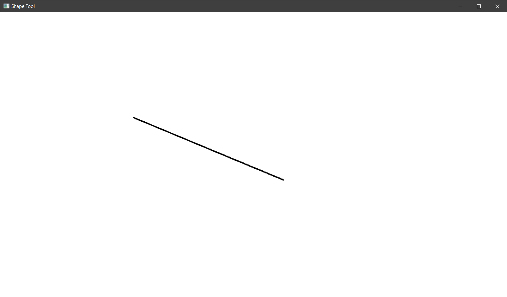
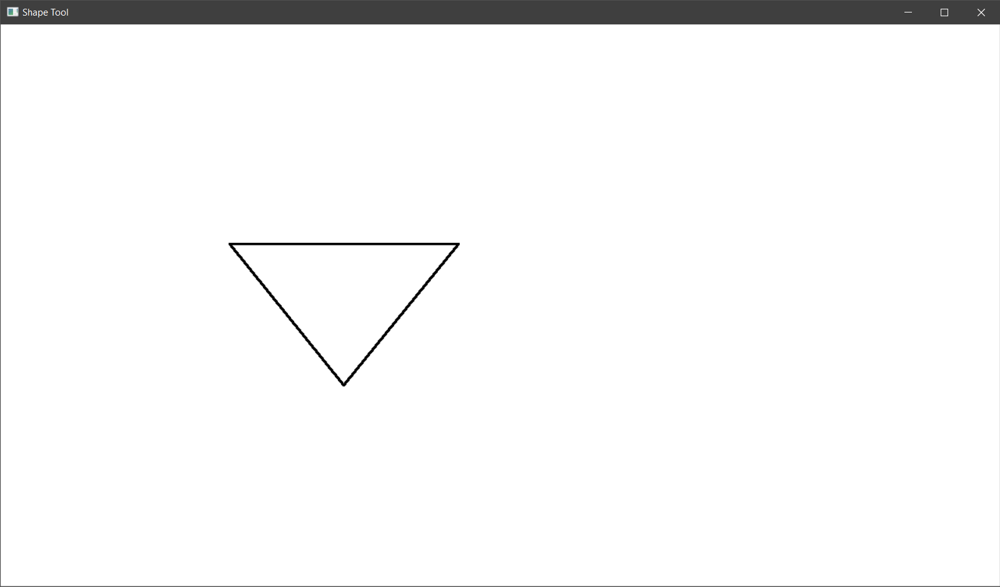
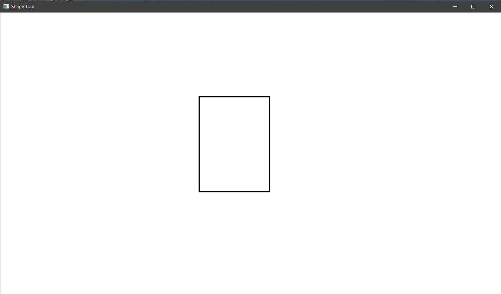
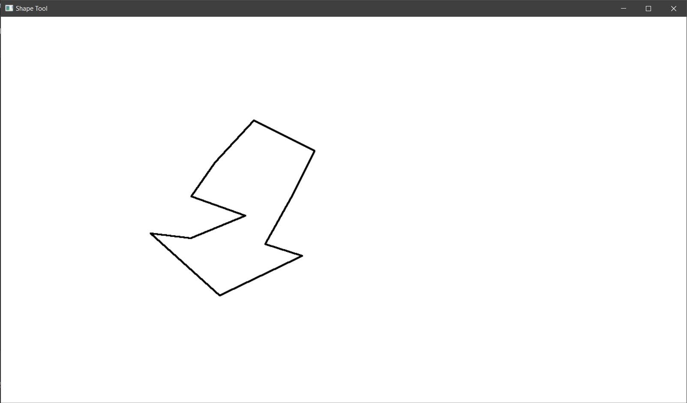
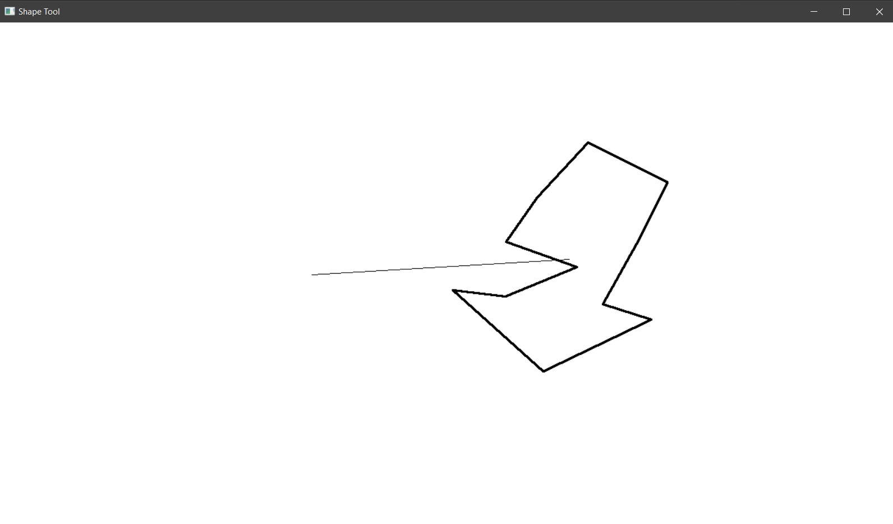
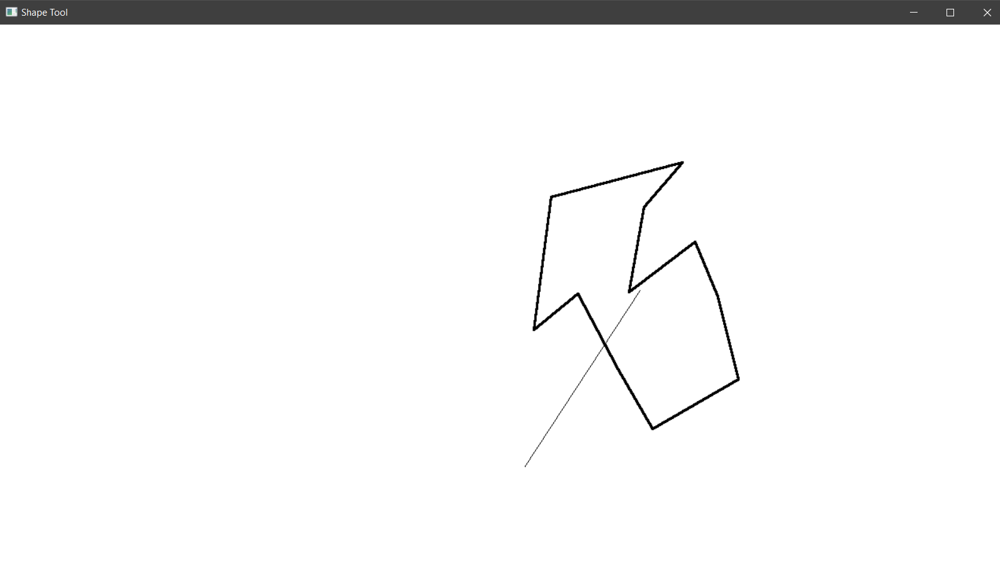
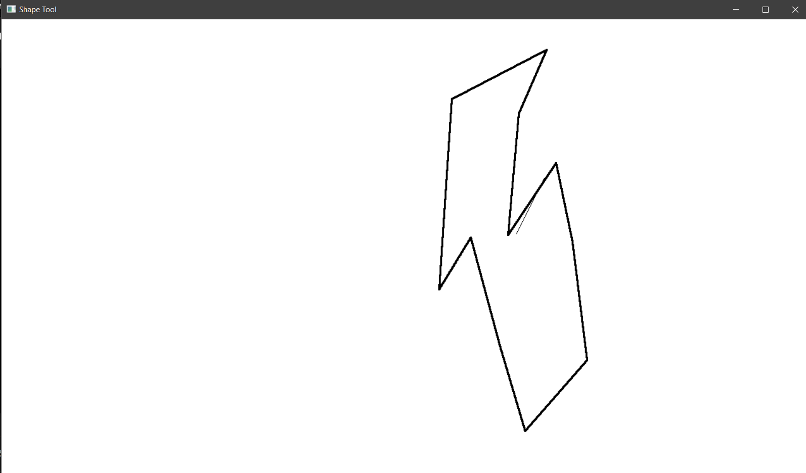

# Draw and Transform

## Introduction
This project is a drawing tool built with c++ language with the help of GLUT library. You can draw point, line, triangle, rectangle and polygon with this tool. After drawing you will aslo be able to scale, move and rotate the shape around with mouse.

## Instruction
*  Press enter to start the drawing tool window.
*  Press 1 to select point drawing mode.
*  Press 2 to select line drawing mode.
*  Press 3 to select triangle drawing mode.
*  Press 4 to select rectangle drawing mode.
*  Press n to select polygon drawing mode. (For drawing polygon, click near the first drawn point to complete the polygon.)
*  After drawing a shape, select a transformation mode and move the mouse to transform the shape
    *  Press t to translate the shape.
    *  Press r to rotate the shape.
    *  Press s to scale the shape.

# Screenshots
Line  

 

Triangle  

 

Rectangle  

 

Polygon  

 

Translating the polygon  

 

Rotating the polygon  

 

Scaling the polygon  

